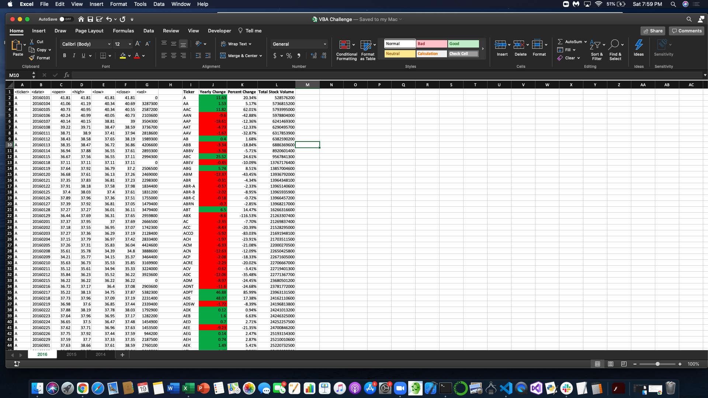

# Stock-Analysis-of-2014-2016
This repository contains an excel file of stock data from 2014-2016 and VBA script that was used to make a summary table of the given stock data. Before any VBA script was created, the spreadsheet only showed the date, stock ticker symbol, opening price, closing price, high, low and volume. The vba script was then set to loop through all the stocks and calculate the yearly change, percent change and total stock volume for each stock. An example of end result can be seen below, and a copy of the code used to carry out these calculations can be found in the "VBA_Script.txt" file. 

